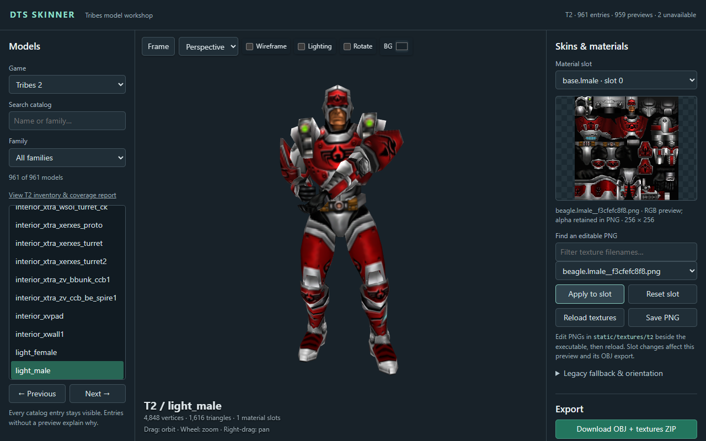

# DTS Skinner

Browse, reskin, and export models from **Starsiege: Tribes, Tribes 2, and Quake 3**. Runs on Windows with a 3D viewer in your browser.

**[Download the latest release](https://github.com/shadoh420/DTS_Skinner/releases/latest)**

## Features

- Browse models and interiors; inspect and replace individual materials.
- Browse texture thumbnails, filter by name, and use skins from any of the three games.
- Export OBJ with textures or GLB with available animations.
- Explore in walk/fly mode and fullscreen; rotate and move models along X/Y/Z.
- Restore the default view and materials with **Reset all**.

## Getting started

1. Download and extract the release ZIP into a writable folder.
2. Run `SkinnerApp.exe`. Keep `static` and `local-data` beside it.
3. Choose a model, select a material and texture, then click **Apply to slot**.

If the browser doesn't open, visit `http://localhost:5000/`. Quit through the app's system-tray menu.

**Controls:** drag to orbit, wheel to zoom, right-drag to pan. **Walk / Fly** (Shift + backtick) uses WASD and Q/E; Escape returns to orbit. Position and rotation changes are preview-only.

See [animation and export details](ANIMATION_EXPORT.md) and [T2 coverage and limitations](T2_IMPORT.md).

Built with Python and Three.js. Inspired by [exogen's T2 Model Skinner](https://github.com/exogen/t2-model-skinner).
