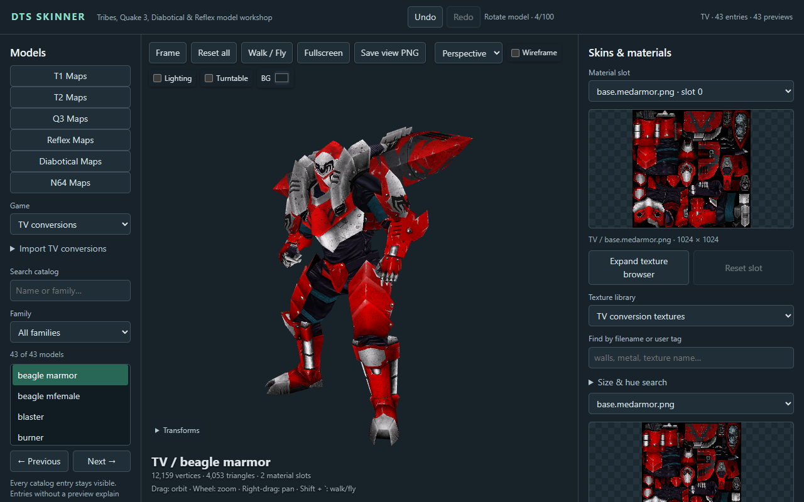
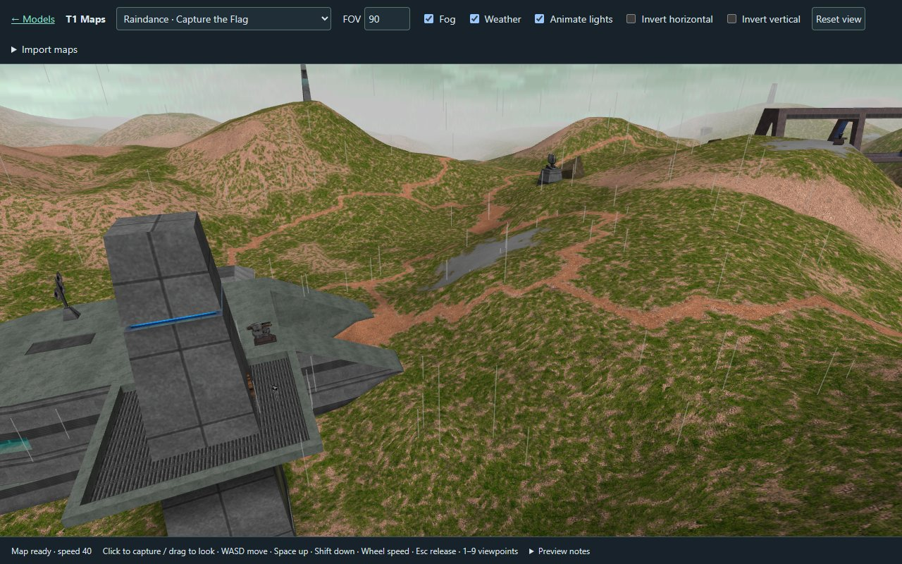
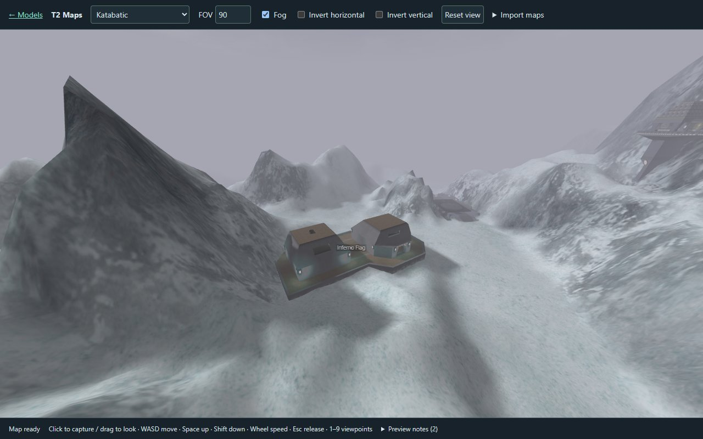
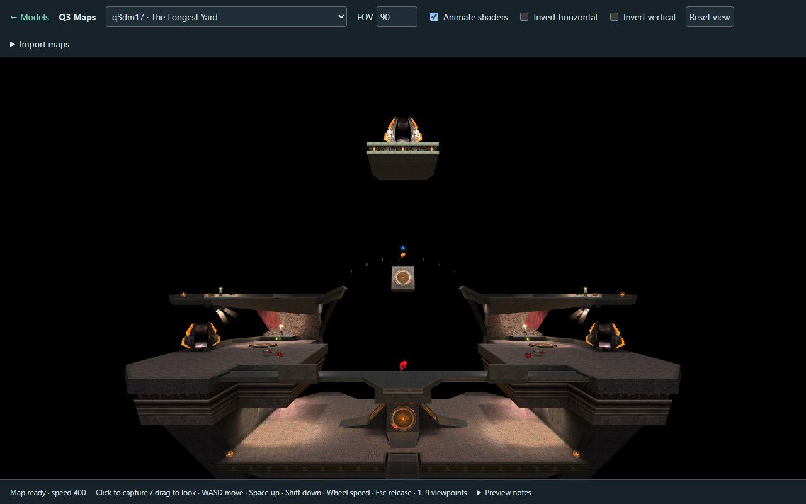
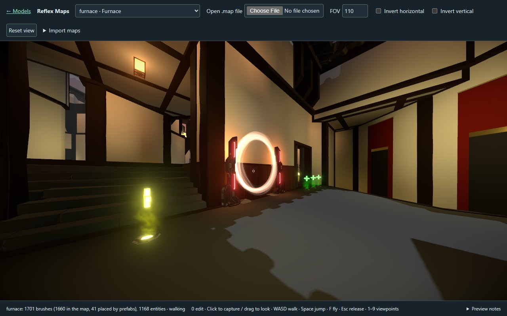
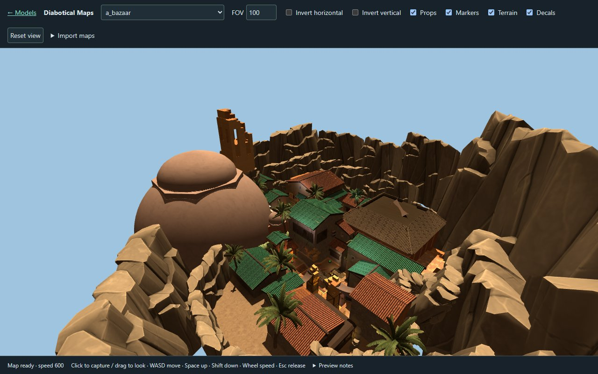

# DTS Skinner

Browse, reskin, and export models from **Starsiege: Tribes, Tribes 2, Quake 3, Diabotical and Reflex Arena**, plus Tribes conversion packs and mods. Fly through maps of Tribes 1 and 2, Quake 3, Reflex Arena (and edit them), Diabotical and N64 level conversions. Runs on Windows with a 3D viewer in your browser.

**[Download the latest release](https://github.com/shadoh420/DTS_Skinner/releases/latest)**

## Features

- Browse models and interiors; inspect and replace individual materials.
- **Diabotical** in the Game list holds what the game's Editpad places, imported from your install (**Import Diabotical models**, about ten minutes the first time): its props, dynamic props (built at their default size, each piece they can use listed under them), pickups, entities (as their pickup or model, else a marker) and utility boxes and sounds, with the Editpad's thumbnails. Its materials, decals, sprays and surface materials become the **Diabotical textures** library, tinted by their default accent colours.
- **Reflex Arena** in the Game list holds the editor's props (with its thumbnails) and the pickups and pads of weapons, ammo, health, armour, powerups and flags, imported from your install (**Import Reflex models**). They are coloured as the game colours them: their material's texture or colour times the effect's colour, as PNGs in the **Reflex textures** library (flat swatches for colour-only materials), shaded by the meshes' vertex colours; GLB keeps those, OBJ cannot. Holograms and glows are drawn as added light.
- **TA conversions** in the Game list holds the 38 models of TE-Krogoth's Tribes Ascend conversion pack for Tribes 1.40 (armors, weapons, grenades, flags, stations, vehicles), imported from the pack's folder (**Import TA conversions**). Each folder's PNG skins, team variants included, form the **TA conversion textures** library; slots the pack has no skin for use the stock Tribes 1 texture. GLB bakes the weapons' and vehicles' animations (slow: up to about a minute); the armors export in their static pose.
- **TV conversions** holds the 43 models of TE-Krogoth's Tribes Vengeance conversion pack (HudBot edition, v2.0.2) for Tribes 1.40: the weapons, packs, stations, vehicles, flag, tower and trees of its base folder and the Blood Eagle, Children of the Phoenix and Starwolf armor sets, imported from the pack's folder (**Import TV conversions**). The HudBot replacement TGAs, team skins included, and Anubis's alternate Diamond Sword flag (`dsword.flag.alt.png`) form the **TV conversion textures** library; the ammo station top, which has no TGA, is decoded from its bitmap with the Tribes 1 shape palette, and other slots use the stock Tribes 1 texture.
- **Tribes mods** are their own games too: **TRPG** (the Tribes 1 RPG mod), **SW** (the Star Wars RPG and Star Wars mods) and **RM** (RedMoon RPG), each imported from the mod's folder with its import box (**Import TRPG models**, **Import SW models**, **Import RM models**; a big mod takes a few minutes). Every model in the folder and in its `.zip` volumes is read, with the mod's PNG skins (or BMP ones, coloured from the palette their header names) as that game's texture library; slots the mod has no skin for use the stock Tribes 1 texture. Only the textures a model uses, plus the other skins of its armors, are kept. **T2RPG** (IronSphere, Tribes 2) has no import box: it needs the external Tribes 2 converter kit, so it is built from the source checkout, see [T2_IMPORT.md](T2_IMPORT.md#ironsphere-t2rpg).
- **Starsiege** in the Game list holds every shape in your Starsiege install's volumes (**Import Starsiege models**, a few seconds): the HERCs, tanks, flyers, drones and pilots under their own categories, and the buildings, weapons and effects under Objects. The bitmaps they use (including the first frame of bitmap arrays) form the **Starsiege textures** library, coloured from the game's palettes, and flat-colour materials become small colour swatches.
- **Earthsiege** and **Earthsiege 2** in the Game list hold every shape in the game's .vol files (**Import Earthsiege models**): the HERCs and Cybrids in their rest pose (armed: Earthsiege 2's HERCs with their stock weapons, every other machine with the weapons its missions give it most), with their wreckage, weapons and effects. Each machine is textured from the bank the game binds to it (light, medium, heavy, enemy and the newer HERCs' own) as the game maps a frame onto each quad, and flat polygons take their shade-ramp colour; the frames form the **Earthsiege textures** libraries, coloured from the first world palette.
- **Red Baron 3D** in the Game list holds every shape in the game's .vol files at its finest detail (**Import Red Baron 3D models**): the aircraft in their first squadron's paint, their cockpits, vehicles, guns, buildings and bridges. Textures come from the game's bitmaps, coloured from the summer palette, with its see-through parts cut out; they form the **Red Baron 3D textures** library.
- **Unreal** in the Game list holds every mesh in the packages of an Unreal or Unreal Gold install (**Import Unreal models**, a few seconds): creatures, players, weapons, pickups, decorations, effects and Return to Na Pali's, in their standing pose. Each slot takes the mesh's own skin, or the one its classes or the actors placed in the maps give it (Skin and MultiSkins); masked, two-sided, translucent and environment-mapped faces are drawn as the game draws them. The skins form the **Unreal textures** library, coloured from their palettes; fire textures, which the game draws as it runs, are drawn from their sparks as a still.
- **Unreal Tournament** does the same for a UT99 install (checked with OldUnreal's 469c patch; **Import Unreal Tournament models**): Botpack's players, weapons, pickups and decorations, the relics, the bonus pack's models and the skeletal Xan Mark II and WarBoss (in their reference pose). The Unreal meshes UT ships are left to the Unreal game. Players, their menu models and trophies wear their default skins from the skin packages (SoldierSkins, CommandoSkins and the rest, face included), as the game puts them on at run time; muzzle flashes and effects are drawn in the style their actors use (translucent, masked). The skins form the **Unreal Tournament textures** library.
- Expand the texture browser, resize thumbnails, and search filenames or your own tags.
- Rotate textures 90° left/right or flip horizontally/vertically using temporary copies; save a copy only when wanted.
- Filter pixel dimensions or find textures with similar size or overall hue, with adjustable tolerances.
- Undo/redo session edits, tags, material choices, model transforms, camera moves, and browsing actions.
- Export OBJ with textures or GLB with available animations.
- Explore in walk/fly mode and fullscreen; rotate and move models along X/Y/Z.
- Expand **Transforms** when needed; position/orientation controls start collapsed.
- Adjust vertical field of view from 20–110° under Navigation, using a slider or exact value. Undo/redo includes FOV; Reset all restores 45°.
- **Save view PNG** downloads the current rendered view, including the background and preview transforms, without interface controls.
- The expanded texture browser keeps **Apply to slot** visible while its settings and thumbnails scroll.
- Restore the default view and materials with **Reset all**.
- **T2 Maps** opens a free-flight preview of Tribes 2 missions with terrain, buildings, placed objects, sky, water and fog: every stock, Classic and Team Rabbit 2 map of your own install, imported from the page's **Import maps** panel; see [T2 map setup and limitations](docs/t2-map-viewer.md).
- **T1 Maps** opens a free-flight preview of Starsiege: Tribes missions: every map in your own install plus custom missions, imported from the page's **Import maps** panel; see [T1 map setup and limitations](docs/t1-map-viewer.md).
- **Q3 Maps** opens a free-flight preview of Quake 3 Arena maps with lightmaps, curved surfaces, shader effects, skies and pickups: every map of your own install, stock, Team Arena and custom pk3s, imported from the page's **Import maps** panel; see [Q3 map setup and limitations](docs/q3-map-viewer.md).
- **Unreal Maps** opens a free-flight preview of the maps of your Unreal install (Unreal Gold with OldUnreal 227, Return to Na Pali included) and your Unreal Tournament install (UT 469), in one list: the level's BSP surfaces with their textures and the map's own lighting (lightmaps rebuilt from its lights and shadow bits), masked, translucent and panning as in the game, the sky zone through the sky surfaces, and the placed meshes and movers where the game starts them, imported per game from the page's **Import maps** panel; see [Unreal map viewer](docs/unreal-map-viewer.md).
- **Reflex Maps** opens Reflex Arena maps to walk through (Quake 3-style movement, teleporters and jump pads) and edits their brushes, textured from the game's materials or any of Skinner's texture libraries (and the game's textures become a fourth library for models): **0** switches to edit mode as in the game, with the game's editor controls (drag to move, Alt to lift, Shift-drag a face, 1–8 to create brushes, volumes and entities, V for vertex mode, B to bridge two faces, C to clip, numpad +/− to turn, the texture keys on one or several faces, mirroring, prefabs made, broken, updated and edited in place, N for properties, K/M materials, G clone, Z/X undo), and brushes are also carved, hollowed, merged and split, and the map is saved back as a `.map` file. Maps are lit as the game lights them: the light probes of the map's baked `.light`, its lights and the sun. Import your install's maps (and Workshop maps) from the page, or open a `.map` file directly; see [Reflex map viewer and brush editor](docs/reflex-map-viewer.md).
- **N64 Maps** opens a free-flight preview of [L. Spiro](https://github.com/L-Spiro)'s N64 level conversions (GoldenEye 007, Perfect Dark, Diddy Kong Racing and more; OBJ + MTL + PNG made for Blender), listed by game: no maps come with Skinner, import your own folder of the conversions from the page's **Import maps** panel. Surfaces are drawn as L. Spiro's Blender material script draws them (unlit, texture times the level's vertex colours, with the clamp, mirror, see-through and decal flags in the material names).
- **Diabotical Maps** opens a free-flight preview of Diabotical maps' blocks in their materials' textures: the game's maps and the ones you made in its editor, imported from the page's **Import maps** panel; see [Diabotical map viewer](docs/diabotical-map-viewer.md).

## Getting started

1. Download and extract the release ZIP into a writable folder.
2. Run `SkinnerApp.exe`. Keep `_internal`, `static` and `local-data` (its animation caches) beside it. Imported maps, models and tags go to
   `%LOCALAPPDATA%\DTS-Skinner\local-data`, shared by every release, so a new release opens with them
   (an older release's `local-data` next to the app is moved there on first start).
3. Choose a model, select a material and texture, then click **Apply to slot**.

If the browser doesn't open, visit `http://localhost:5000/`. Starting it again while it runs just opens the browser on it. Quit through the app's system-tray menu.

**Controls:** drag to orbit, wheel to zoom, right-drag to pan. **Walk / Fly** (Shift + backtick) uses WASD and Q/E; Escape returns to orbit. Position and rotation changes are preview-only.

### Texture workshop

**Expand texture browser** opens a large gallery with adjustable thumbnail size. Selecting a thumbnail previews it without changing the model. Rotate or flip the selected texture, then **Apply to slot** to see the copy on the model. **Save rotated copy** downloads a separate PNG with alpha preserved; it does not add it to the library. Applied copies also appear in OBJ and GLB exports. Original PNGs are never overwritten. Copies are temporary for the current window and disappear on reload/close; place a saved PNG in the relevant texture folder and reload to keep it in the library.

Enter comma-separated **User tags** such as `walls, metal, concrete`, then **Save tags**. Tags are stored by game and filename in `local-data/texture-tags.json` and remain available after restart. Filename/tag search matches all entered words.

Under **Size & hue search**, width and height limits are inclusive; leave either end blank for no limit. For example, Width min `100` and Width max `120` finds textures 100–120 pixels wide at any height. **Find similar size** uses the highlighted texture's original dimensions and a ±pixel tolerance for each dimension (zero means exact). **Find similar hue** compares a sampled, chroma-weighted circular average hue, with tolerance from 0 to 180 degrees. Neutral or color-balanced textures without a meaningful average match each other. Hue search is a color aid, not image/pattern recognition. Transparent pixels contribute less; T2 uses RGB because alpha can store reflectivity. Similarity buttons clear previous search filters; changing tolerance updates matches immediately.

**Undo / Redo** retain the latest 100 actions in the current window, including persisted tag edits. Use Ctrl+Z and Ctrl+Shift+Z / Ctrl+Y outside text fields (text fields keep native text undo). Reset all is undoable. Downloads and external PNG edits are not reversed. Importing a new Q3 catalog starts a new history; window reload/close also clears history. Existing PNGs and saved tags remain on disk.

Switching games reads texture dimensions without decoding every image. Color analysis starts on the first **Find similar hue** request and can take several seconds for large libraries; subsequent searches reuse cached results until a texture changes. Selecting a texture reuses the gallery thumbnails.

Developer checks: `python -B -m unittest discover -s tests -v`, then run `node tools/check_texture_workshop.cjs http://127.0.0.1:5000 build/workshop-review` with optional Playwright available. The browser check verifies real texture pixels/downloads, gallery layout, search, and history without adding image files to the library.

Viewport checks: `node tools/check_viewport_workshop.cjs http://127.0.0.1:5000 build/viewport-review` verifies visible gallery actions at three window sizes, collapsed transforms, FOV/reset/history, and nonblank PNG downloads for all three games. Run against the packaged executable with its complete texture/model libraries.

## Screenshots

| T1 Maps (Raindance) | T2 Maps (Katabatic) |
| --- | --- |
|  |  |
| **Q3 Maps (The Longest Yard)** | **Reflex Maps (Furnace)** |
|  |  |
| **Diabotical Maps (Bazaar)** | |
|  | |

See [animation and export details](ANIMATION_EXPORT.md) and [T2 coverage and limitations](T2_IMPORT.md).

Built with Python and Three.js. Inspired by [exogen's T2 Model Skinner](https://github.com/exogen/t2-model-skinner). N64 map support thanks to [L. Spiro](https://github.com/L-Spiro), whose level conversions and Blender material rules it follows, used with permission.
